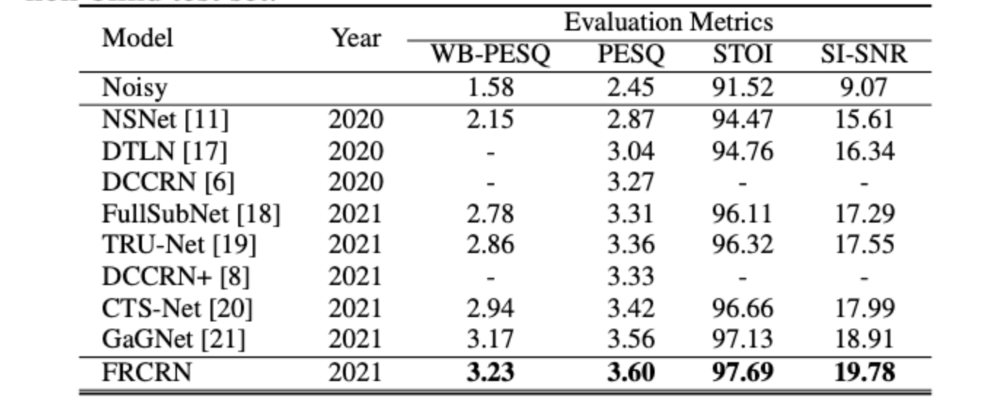

---
tasks:
- acoustic-noise-suppression
widgets:
- task: acoustic-noise-suppression
  inputs:
  - type: audio
    name: input
    title: 带噪音的原始音频
    validator:
      max_size: 10M
  examples:
  - name: 1
    title: 示例1
    inputs:
    - name: input
      data: git://examples/speech_with_noise.wav
  inferencespec:
    cpu: 1
    memory: 1000
    gpu: 0
    gpu_memory: 1000
model_type:
- complex-nn
domain:
- audio
frameworks:
- pytorch
model-backbone:
- frcrn
license: Apache License 2.0
tags:
- Alibaba
- Mind DNS
---


# FRCRN语音降噪模型介绍

本模型提供音频通话场景和各种噪声环境下语音音频录音的单通道语音智能降噪模型算法。

## 模型描述

模型输入和输出均为16kHz采样率单通道语音时域波形信号，输入信号可由单通道麦克风直接进行录制，输出为噪声抑制后的语音音频信号[1]。模型采用Deep Complex CRN结构，模型输入信号通过STFT变换转换成复数频谱特征作为输入，并采用Complex FSMN在频域上进行关联性处理和在时序特征上进行长序处理，预测中间输出目标Complex ideal ratio mask, 然后使用预测的mask和输入频谱相乘后得到增强后的频谱，最后通过STFT逆变换得到增强后语音波形信号。模型的训练数据采用了DNS-Challenge开源数据集[2]。


## 期望模型使用方式以及适用范围


### 如何使用

在安装ModelScope完成之后即可使用```speech_frcrn_ans_cirm_16k```进行推理。模型输入和输出均为16kHz采样率单通道语音时域波形信号，输入信号可由单通道麦克风直接进行录制，输出为噪声抑制后的语音音频信号。为了方便使用在pipeline在模型处理前后增加了wav文件处理逻辑，可以直接读取一个wav文件，并把输出结果保存在指定的wav文件中。

#### 环境准备：

* 本模型已经在1.8~1.11下测试通过，由于PyTorch v1.12.0的[BUG](https://github.com/pytorch/pytorch/issues/80837)，目前无法在v1.12.0上运行，如果您已经安装了此版本请执行以下命令回退到v1.11

```
conda install pytorch==1.11 torchaudio torchvision -c pytorch
```

* 本模型的pipeline中使用了三方库SoundFile进行wav文件处理，**在Linux系统上用户需要手动安装SoundFile的底层依赖库libsndfile**，在Windows和MacOS上会自动安装不需要用户操作。详细信息可参考[SoundFile官网](https://github.com/bastibe/python-soundfile#installation)。以Ubuntu系统为例，用户需要执行如下命令:

```shell
sudo apt-get update
sudo apt-get install libsndfile1
```

#### 代码范例

```python
from modelscope.pipelines import pipeline
from modelscope.utils.constant import Tasks


ans = pipeline(
    Tasks.acoustic_noise_suppression,
    model='damo/speech_frcrn_ans_cirm_16k')
result = ans(
    'https://modelscope.oss-cn-beijing.aliyuncs.com/test/audios/speech_with_noise.wav',
    output_path='output.wav')
```

### 模型局限性以及可能的偏差

模型在存在多说话人干扰声的场景噪声抑制性能有不同程度的下降。

## 数据评估及结果

与其他SOTA模型在DNS Challenge 2020官方测试集上对比效果如下：



指标说明：

* PESQ (Perceptual evaluation of speech quality) 语音质量感知评估，是一种客观的、全参考的语音质量评估方法，得分范围在-0.5--4.5之间，得分越高表示语音质量越好。
* STOI (Short-Time Objective Intelligibility) 短时客观可懂度，反映人类的听觉感知系统对语音可懂度的客观评价，STOI 值介于0~1 之间，值越大代表语音可懂度越高，越清晰。
* SNR (Signal-to-Noise Ratio) 语音信号信噪比，是衡量针对宽带噪声失真的语音增强算的常规方法。

更多详情请参考下面相关论文。

### 相关论文以及引用信息

[1]

```BibTeX
@INPROCEEDINGS{9747578,
  author={Zhao, Shengkui and Ma, Bin and Watcharasupat, Karn N. and Gan, Woon-Seng},
  booktitle={ICASSP 2022 - 2022 IEEE International Conference on Acoustics, Speech and Signal Processing (ICASSP)}, 
  title={FRCRN: Boosting Feature Representation Using Frequency Recurrence for Monaural Speech Enhancement}, 
  year={2022},
  pages={9281-9285},
  doi={10.1109/ICASSP43922.2022.9747578}}
```

[2]

```BibTeX
@INPROCEEDINGS{9747230,
  author={Dubey, Harishchandra and Gopal, Vishak and Cutler, Ross and Aazami, Ashkan and Matusevych, Sergiy and Braun, Sebastian and Eskimez, Sefik Emre and Thakker, Manthan and Yoshioka, Takuya and Gamper, Hannes and Aichner, Robert},
  booktitle={ICASSP 2022 - 2022 IEEE International Conference on Acoustics, Speech and Signal Processing (ICASSP)}, 
  title={Icassp 2022 Deep Noise Suppression Challenge}, 
  year={2022},
  pages={9271-9275},
  doi={10.1109/ICASSP43922.2022.9747230}}
```
